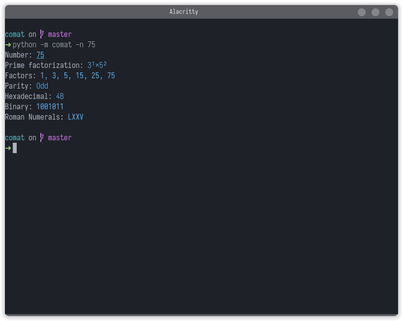

# Comat

## A cat clone made for numbers

As UNIX-based Operating Systems have `cat` for displaying the contents for a file, `comat` is a CLI app to look at numbers (prime factorization, factors, patterns, etc)

*Note: `mat` has been renamed to `comat` due to conflict with another project on PyPI ('co' for cogniforge and 'mat' for the original name of the project)*

<!--More will be added! -->
## Installing the necessary dependencies and testing the project

```bash
chmod +x init.sh
./init.sh
```

You can then run the project with `python3 comat.py -n <number>`.
